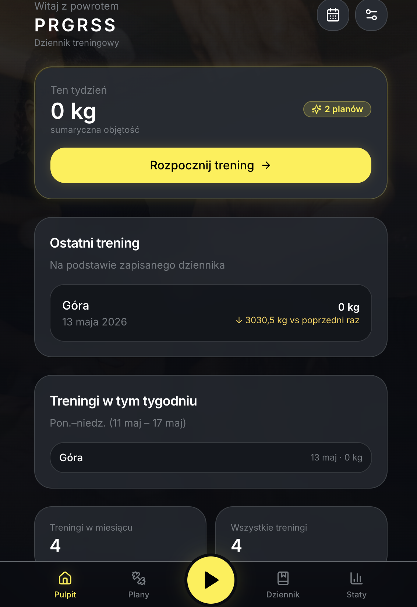
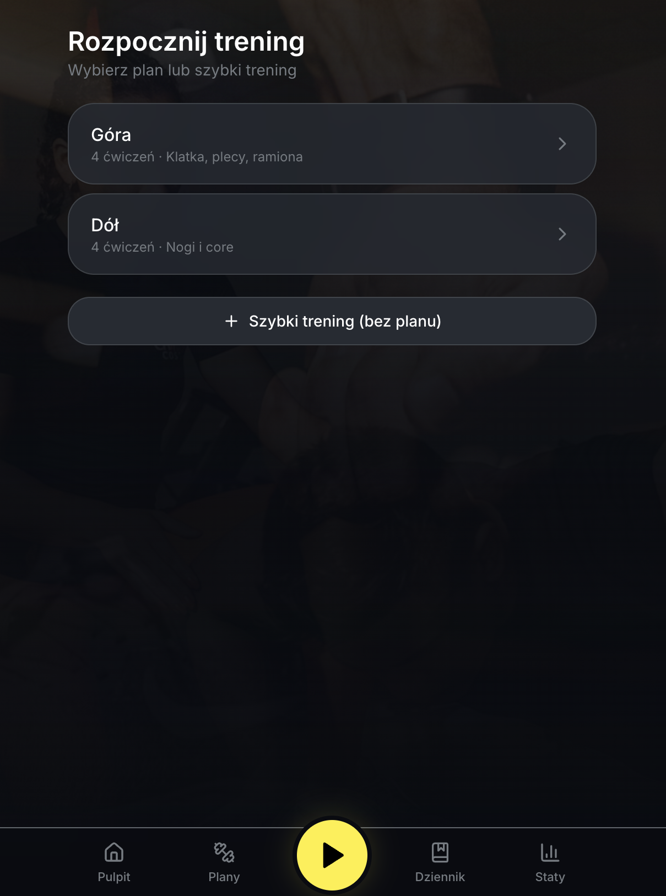
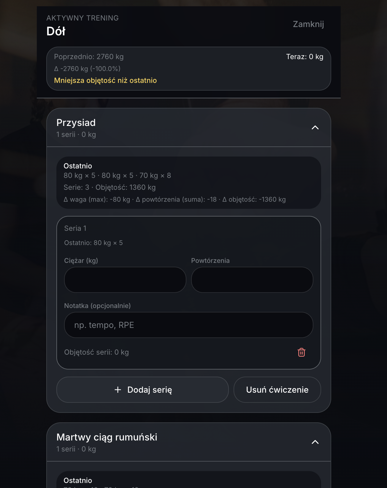
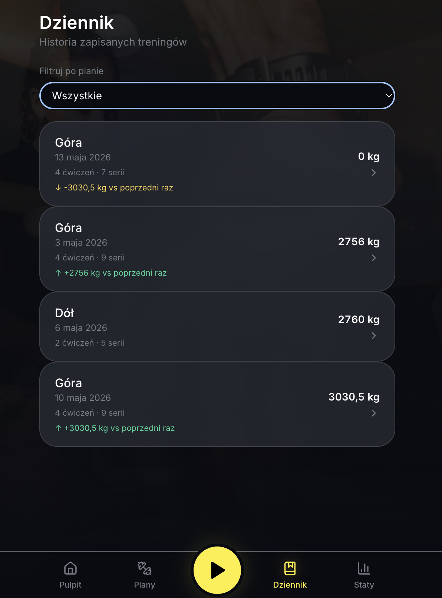
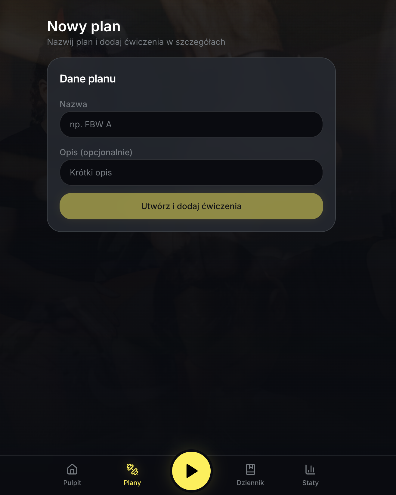
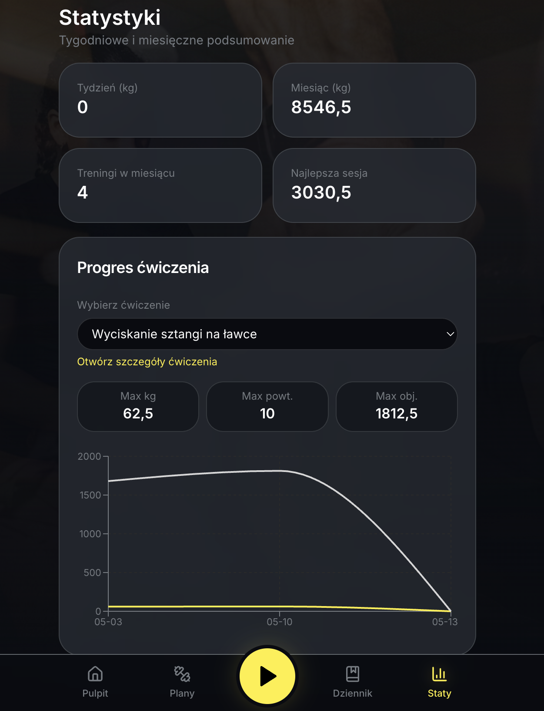

# PRGRSS

Aplikacja webowa (Next.js) do planowania treningów siłowych, zapisywania serii z ciężarem i powtórzeniami oraz śledzenia progresu. Dane zapisywane są lokalnie w przeglądarce (`localStorage`).

## Wariant iOS (Xcode — iPhone 14 Pro Max i inne)

Ten katalog to kopia projektu z **eksportem statycznym** Next.js (`out/`) oraz **Capacitor** (`@capacitor/ios`). Ta sama logika i UI działają w **WKWebView** jak w PWA; możesz budować i uruchamiać w Xcode na dowolnym symulatorze lub urządzeniu (np. **iPhone 14 Pro Max**, **iPhone 16 Pro**).

### Krok 1 — Xcode

Zainstaluj [Xcode](https://developer.apple.com/xcode/) z App Store (w tym **Xcode Command Line Tools**).

### Krok 2 — CocoaPods (wybierz jedną ścieżkę)

**A — Zalecane w tym repo (Bundler, bez globalnego `pod`):** w katalogu projektu jest `Gemfile`. Capacitor wykrywa go i używa `bundle exec pod install` zamiast szukać `pod` w PATH.

Skrypty `npm run ios:*` **dokładają na początek `PATH`** typowe ścieżki Ruby z Homebrew (`/opt/homebrew/opt/ruby/bin` oraz `/usr/local/opt/ruby/bin`), więc po `brew install ruby` często **nie musisz** jeszcze edytować `~/.zshrc`, żeby `bundle install` zadziałał.

1. Sprawdź wersję Ruby — **wklej tylko to jedno polecenie** (komentarz ` # ...` w tej samej linii co `ruby` bywa źle interpretowany i daje błąd w stylu `No such file or directory -- #`):

```bash
ruby -v
```

2. Jeśli widzisz **2.6.x** (systemowy Ruby na macOS), doinstaluj nowszy Ruby i Bundler:

```bash
brew install ruby
export PATH="/opt/homebrew/opt/ruby/bin:/usr/local/opt/ruby/bin:$PATH"
ruby -v
gem install bundler
```

3. W katalogu projektu:

```bash
cd ~/Desktop/prgrss-ios
npm install
npm run ios:add
```

To ustawi lokalną ścieżkę gemów (`vendor/bundle`), uruchomi `bundle install`, zbuduje `out/` i doda platformę **ios** (`npx cap add ios`).

**B — Globalny CocoaPods (Homebrew):** `brew install cocoapods`, potem klasycznie `npm run build`, `npx cap add ios`, `npx cap sync ios`. Jeśli `brew` zgłasza błędy uprawnień do `/opt/homebrew`, postępuj według komunikatu (np. `sudo chown -R $(whoami) /opt/homebrew`).

### Krok 3 — Xcode i symulator

```bash
npm run ios:open
```

W Xcode wybierz schemat **App**, urządzenie (np. **iPhone 14 Pro Max**) i **Run** (▶).

Po zmianach w kodzie Next/React: `npm run ios:sync` (przebuduje `out` i zsynchronizuje zasoby z `ios/`).

### Błąd „CocoaPods is not installed” / „ios platform has not been added yet”

Najpierw musi powstać folder **`ios/`** — robi to **`npx cap add ios`** po udanym sprawdzeniu CocoaPods. Gdy nie masz globalnego `pod`, użyj ścieżki **A** (`npm run ios:add` po `npm install`). Gdy `bundle install` się wyłoży na wersji Ruby, zainstaluj Ruby z Homebrew (krok 2 powyżej) i powtórz `npm run ios:add`.

### Błąd `The --path flag has been removed` (Bundler 4)

Skrypty `npm run ios:bundler` / `npm run ios:add` używają już `bundle config set --local path vendor/bundle` zamiast `--path`. Zaktualizuj repo (`package.json` z ostatniej wersji) i ponów `npm run ios:add`.

### Błąd `ruby: No such file or directory -- # (LoadError)`

Zwykle oznacza, że w **jednej linii** z `ruby` znalazł się znak `#` (np. wklejono `ruby -v  # komentarz`). Uruchom **`ruby -v`** jako osobną linię, bez niczego po `#` w tej samej linii.

**Uwaga:** z powodu `output: "export"` serwer `next start` nie obsługuje statycznego eksportu — do pracy nad UI używaj `npm run dev`; do testów w symulatorze użyj workflow powyżej.

## Zrzuty ekranu

Interfejs jest **mobile-first** (wygodnie na telefonie, PWA), motyw **ciemny** z **żółtymi** akcentami i delikatnym tłem z siłowni.

Poniżej **kolejność jak w aplikacji**: od pulpitu, przez start i zapis treningu, dziennik i plany, po statystyki. Pliki PNG wrzuć do [`docs/screenshots/`](./docs/screenshots/) — **nazwy muszą się zgadzać** z podpisami pod obrazkami (albo zmień ścieżki w README). Szczegóły i skrócona ściąga: [`docs/screenshots/README.md`](./docs/screenshots/README.md).

Na GitHubie zrzuty są **wyśrodkowane** i mają szerokość **320 px** (`<p align="center">` + ``). Żeby **same pliki** były lżejsze, zmniejsz je lokalnie (np. `sips` — patrz `docs/screenshots/README.md`).

### 1. Pulpit

Powitanie, **podsumowanie tygodnia** (objętość), skrót **ostatniego treningu** z porównaniem do poprzedniego razu, lista treningów w bieżącym tygodniu oraz szybkie liczniki (np. treningi w miesiącu). Stąd jednym tapnięciem **„Rozpocznij trening”**.

<p align="center">
  
</p>

### 2. Rozpocznij trening

Wybór **planu** (np. góra / dół z krótkim opisem) albo **szybki trening** bez planu. To ekran startu sesji — po wyborze przechodzisz do aktywnego treningu.

<p align="center">
  
</p>

### 3. Aktywny trening

**Porównanie objętości** bieżącej sesji z ostatnią (np. ostrzeżenie, gdy jest mniejsza). Karty **ćwiczeń**: sekcja *Ostatnio* (historia serii), pola na **ciężar** i **powtórzenia**, opcjonalna notatka (tempo, RPE), objętość serii, dodawanie serii i usuwanie ćwiczenia.

<p align="center">
  
</p>

### 4. Dziennik

**Historia zapisanych treningów** z filtrem po planie. Każda karta: nazwa treningu, data, liczba ćwiczeń i serii, **sumaryczna objętość** oraz **delta** względem poprzedniej sesji (↑ wzrost / ↓ spadek).

<p align="center">
  
</p>

### 5. Nowy plan

Tworzenie planu: **nazwa**, opcjonalny **opis**, potem przejście do **dodawania ćwiczeń** w szczegółach planu.

<p align="center">
  
</p>

### 6. Statystyki

**Podsumowanie** tygodniowe i miesięczne (kg, liczba treningów, najlepsza sesja). **Progres wybranego ćwiczenia**: max ciężar, powtórzenia, objętość oraz **wykres** w czasie.

<p align="center">
  
</p>

## Uruchomienie lokalne

Wymagany jest **Node.js 18+** oraz **npm**.

```bash
cd ~/Desktop/prgrss-ios
npm install
npm run dev
```

Następnie otwórz w przeglądarce adres wskazany w terminalu (domyślnie [http://localhost:3000](http://localhost:3000)).

## Skrypty

- `npm run dev` — serwer deweloperski  
- `npm run build` — build produkcyjny  
- `npm run start` — uruchomienie po buildzie  
- `npm run lint` — ESLint  

## Stack

Next.js (App Router), TypeScript, Tailwind CSS, Zustand (persist), Framer Motion, Recharts, Radix UI, Lucide.

## Styl i kolorystyka

Motyw ciemny w stylu premium fitness (inspiracje m.in. [Fitness / Health Mobile App](https://www.behance.net/gallery/218839947/Fitness-Health-Mobile-App-UI-UX), [Fitty](https://www.behance.net/gallery/246050957/Fitty-Smart-Fitness-Mobile-App), [PulseUp](https://www.behance.net/gallery/231755045/PulseUp-AI-Fitness-App-UIUX-Design)). Paleta oparta m.in. o głębokie granaty/ciemne szarości i żółte akcenty (`#090C11`, `#202020`, `#262B32`, `#FFEE32`, `#FFD100`, `#757B81`, `#D6D6D6`) — wartości w `tailwind.config.ts`.

## Tło (zdjęcia)

Globalnie, za treścią aplikacji, są **przyciemnione** zdjęcia atmosferyczne (domyślnie stock **Unsplash**). Możesz je zastąpić własnymi plikami w `public/bg/` i zmienić URL-e w `components/ambient-background.tsx`.

## Wypchnięcie na GitHub

Repozytorium docelowe: [github.com/Goudass/PRGRSS_app](https://github.com/Goudass/PRGRSS_app).

```bash
cd ~/Desktop/prgrss-ios
git status
git remote add origin https://github.com/Goudass/PRGRSS_app.git
# jeśli origin już istnieje: git remote set-url origin https://github.com/Goudass/PRGRSS_app.git
git branch -M main
git add -A
git commit -m "PRGRSS — MVP, styl premium, PWA"
git push -u origin main
```

Jeśli na GitHubie utworzyłeś repozytorium z plikiem `README.md` / `.gitignore`, przy pierwszym pushu może być potrzebne: `git pull origin main --rebase` (lub scalenie), potem ponownie `git push`.

Uwierzytelnienie: **SSH** (`git@github.com:Goudass/PRGRSS_app.git`) albo **HTTPS** z tokenem osobistym zamiast hasła.

## Własna „aplikacja” na telefonie (PWA)

**PRGRSS** działa jako aplikacja **webowa** z **PWA** (`app/manifest.ts`, ikona `public/icon.svg`): po wdrożeniu pod **HTTPS** możesz dodać ją do ekranu głównego i uruchamiać w trybie **standalone** (bez paska adresu, jak zwykła apka).

1. **Wdroż** projekt (np. [Vercel](https://vercel.com) — import z GitHuba, `npm run build` jako komenda build). Darmowy hosting + HTTPS.
2. Na **telefonie** otwórz **wydany adres** (np. `https://twoja-apka.vercel.app`).
3. **Dodaj do ekranu głównego**  
   - **iPhone (Safari):** ikona udostępniania → **Dodaj do ekranu początkowego**  
   - **Android (Chrome):** menu ⋮ → **Zainstaluj aplikację** / **Dodaj do ekranu głównego**

**Dane** (`localStorage`) są przypisane do **adresu domeny** — zawsze używaj tego samego URL, żeby historia się nie „zerowała”.  
**Prywatność:** nie udostępniaj linku; repo może być prywatne; opcjonalnie włącz ochronę hasłem po stronie hosta (np. Vercel Deployment Protection).

**Tylko w LAN** (`http://192.168.x.x:3000`) — na iOS instalacja z ekranu głównego bywa ograniczona bez HTTPS; do codziennego użytku jako „apka” wygodniej jest mieć **wdrożoną** wersję pod HTTPS.
